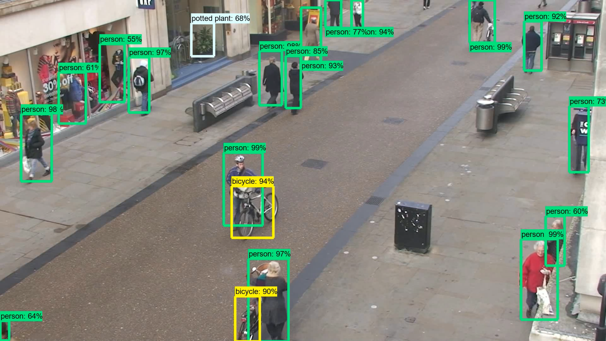
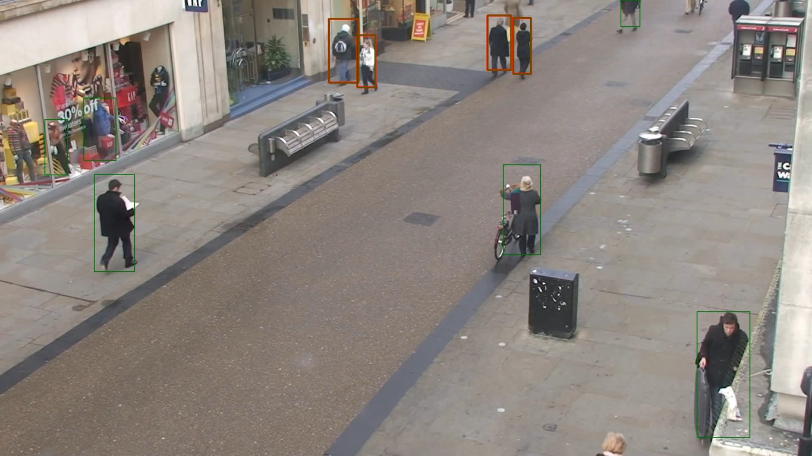

# Object Detection-Human Detection-Social Distancing using Tensorflow Object Detection
# Specific Object Detection using Tensorflow Object Detection API

STEPS : 
1. Object Detection using TensorFlow Object Detection API
2. Convert Video To Images
3. Visualize Objects in Image
4. Delete Boxes of other Objects except for Human
5. Visualize Humans
6. Calculate distance between Human Objects using Euler's distance formula between center points of both objects
7. Change color of human objects which are breaking rules of social distancing.
8. Visualize The Output Image
9. Convert Images to Video

*To Detect Specific Object You Required print category-index and get the key of your object* 
*Replace 1 which represent Person with the key of your object in VisualizeHumansImage* 
*if(output_dict['detection_classes'][index] != 1):* 
        *indexes_not_human.append(index)* 
*Change this 1* 
*PATH_TO_LABELS = 'models/research/object_detection/data/mscoco_label_map.pbtxt'* 
*category_index = label_map_util.create_category_index_from_labelmap(PATH_TO_LABELS, use_display_name=True)* 
*print this category index to get the key of objects you can detect* 

Input Dataset : https://www.robots.ox.ac.uk/ActiveVision/Research/Projects/2009bbenfold_headpose/Datasets/TownCentreXVID.avi

Outputs :

<h3>Object Detection</h3>

<h3>Social Distancing</h3>

Functions

1. load_model
2. run_inference_for_single_image
3. VideoToFrames
4. VisualizeImage
5. DisplayImage
6. FramesToVideo
7. getSingleHumanCoordinates
8. getDistance
9. VisualizeSocialDistancing
10. VisualizeHumanImage
11. FramesToStore
12. SocialDistanceToVideo

**Functions Explaination**:

1. **load_model**   

    *Args*  : 
    &nbsp;&nbsp;&nbsp;model_name : Passing Tensorflow model Name 
    *Returns* :  
            &nbsp;&nbsp;&nbsp;Trained model 

2. **run_inference_for_single_image**  

    *Args* : 
          &nbsp;&nbsp;&nbsp;model : Passing loaded Model 
          &nbsp;&nbsp;&nbsp;image : Image to be processed 
    
    *Returns* :  
              &nbsp;&nbsp;&nbsp;Output Dictionary which contains 
              &nbsp;&nbsp;&nbsp;1. Detected Boxes Dimensions 
              &nbsp;&nbsp;&nbsp;2. Detected Classes index  
                 &nbsp;&nbsp;&nbsp;eg [1,2,3] 1 is for Person 
              &nbsp;&nbsp;&nbsp;3. Detected Scores which is  
                 &nbsp;&nbsp;&nbsp;list of scores for each detection 
              &nbsp;&nbsp;&nbsp;4. Number of Detected Objects 

3.  **VideoToFrames**  

    *Args* :  
          &nbsp;&nbsp;&nbsp;VideoFileName : Pass name of video file with ext  
          &nbsp;&nbsp;&nbsp;Path : Pass Path where to store Frames 
    
    *Returns* : 
            &nbsp;&nbsp;&nbsp;Creates Frames From video and store it in path 

4.  **VisualizeImage** 
    
    *Args* :  
          &nbsp;&nbsp;&nbsp;ImageName : Pass name of Image to be Visualized 
          &nbsp;&nbsp;&nbsp;Path : path to the image 
          
    *Returns* : 
            &nbsp;&nbsp;&nbsp;Image with object detected boxes drawn on it 

5. **DisplayImage** 

    *Args* : 
          &nbsp;&nbsp;&nbsp;Image : numpy array Image 
          
    *Outputs* : 
            &nbsp;&nbsp;&nbsp;Prints image to output 

6. **FramesToVideo** 

    *Args* : 
          &nbsp;&nbsp;&nbsp;no_of_frames : Number of frames to be converted to 
                &nbsp;&nbsp;&nbsp;Video 
                         
    *Outputs* : 
            &nbsp;&nbsp;&nbsp;The Video with 15 fps created using 0-n frames 

7. **getSingleHumanCoordinates** 

    *Args* : 
          &nbsp;&nbsp;&nbsp;Boxes : List of Detected boxes coordinates 
          &nbsp;&nbsp;&nbsp;Image : Image  
          &nbsp;&nbsp;&nbsp;position: position of object from list of  
                    coordinates 
                    
    *Returns* :  
            &nbsp;&nbsp;&nbsp;Left right bottom top coordinates of object 

8. **getDistance** 

    *Args* : 
          &nbsp;&nbsp;&nbsp;x1,x2,y1,y2 : Coordinates to find Distance 
          
    *Returns* : 
          &nbsp;&nbsp;&nbsp;Distance between (x1,y1) and (x2,y2) 

9. **VisualizeSocialDistancing** 

    *Args* : 
          &nbsp;&nbsp;&nbsp;Boxes : List of Coordinates of all objects 
          &nbsp;&nbsp;&nbsp;Image : Image To Visualize 
          
    *Outputs* : 
          &nbsp;&nbsp;&nbsp;Draws red color on boxes near to each other 

10. **VisualizeHumanImage** 

    *Args* : 
          &nbsp;&nbsp;&nbsp;ImageName : Name of Image File to Visualize 
          &nbsp;&nbsp;&nbsp;Path : path to Image 
          
    *Returns* : 
          &nbsp;&nbsp;&nbsp;Image with Boxes drawen 

11. **FramesToStore** 

    *Args* :  
          &nbsp;&nbsp;&nbsp;tillFrame : Pass number of Frames to Visualize 
          
    *Outputs* : 
            &nbsp;&nbsp;&nbsp;Stores Visualized Image To SocialDistancingFrames 
            &nbsp;&nbsp;&nbsp;Folder 

12. **SocialDistanceToVideo** 

    *Args* : 
          &nbsp;&nbsp;&nbsp;no_of_frames : Pass number of Frames 
          
    *Outputs* : 
            &nbsp;&nbsp;&nbsp;Video till no_of_frames of 15fps 
